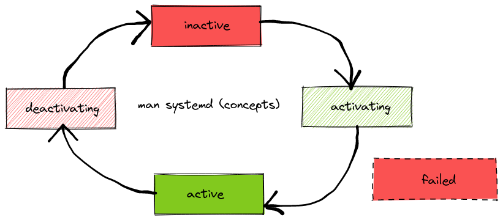

# systemd

## units

### states

A unit can be in the following states:



### types

The type of an unit controls the time when the unit switches
from `activating` to `active` state.

systemd always uses the `fork` and `execve` syscalls to start
the process of an unit.


# Runtime changes

Change properties on runtime
```shell
systemctl set-property --runtime name property=value
```

# Graph

Show dependencies in a graph
```shell
systemd-analyze dot sshd.service | dot -Goverlap=false -Tpng | feh -
```

# Debug

Start unit in debug mode
```shell
SYSTEMD_LOG_LEVEL=debug /lib/systemd/systemd-networkd
```

# List

List enabled units
```shell
systemctl list-unit-files --state=enabled
```

# Unit tweaks

## Resources

```shell
# Per user/process limits
## Directive        ulimit equivalent     Unit
## LimitCPU=        ulimit -t             Seconds      
## LimitFSIZE=      ulimit -f             Bytes
## LimitDATA=       ulimit -d             Bytes
## LimitSTACK=      ulimit -s             Bytes
## LimitCORE=       ulimit -c             Bytes
## LimitRSS=        ulimit -m             Bytes
## LimitNOFILE=     ulimit -n             Number of File Descriptors 
## LimitAS=         ulimit -v             Bytes
## LimitNPROC=      ulimit -u             Number of Processes 
## LimitMEMLOCK=    ulimit -l             Bytes
## LimitLOCKS=      ulimit -x             Number of Locks 
## LimitSIGPENDING= ulimit -i             Number of Queued Signals 
## LimitMSGQUEUE=   ulimit -q             Bytes
## LimitNICE=       ulimit -e             Nice Level 
## LimitRTPRIO=     ulimit -r             Realtime Priority  
## LimitRTTIME=     No equivalent

# Cgroups
## CPU
CPUShares=1024
# or
CPUQuota=20%

## Memory
MemoryMax=1G

## Process count
TasksMax=1024

## IO
IOWeight=100
```

## Retry

`StartLimitInterval` is a moving window. In this window, the number of restarts is limited by `StartLimitBurst`.
The time between these restarts is defined by `RestartSec`.

*Example*

If my service restarts more than 3 times in 1 minute, stop restarting.

```shell
Restart=always
RestartSec=0 # immediately restart after failure
StartLimitInterval=60 # in newer systemd versions this is renamed to StartLimitIntervalSec; use 0 if you want endless restarts
StartLimitBurst=3
```

Now imagine a service which fails after 1 second, this would happen:

* 0s: service is started
* 1s: service fails and gets restarted
* 2s: service fails and gets restarted
* 3s: service fails and gets restarted
* 4s: service fails; limit is reached

If we want this service to never reach the limit, even when it fails every second, we could change either:

* set the burst limit to a value greater or equal to the window:

`StartLimitBurst=60`

*result:* at second 61, the restart counter is decreased by 1 (because the first restart was 60s ago, at second 1) and also increased because of the current restart. So it does not change, but we are right on the edge.

or

* set the restart interval to a value which makes this true : `RestartSec (x) * StartLimitBurst (3) >= StartLimitInterval (60)`

`RestartSec=20`

*result:* the 4th restart would be on second 81, when we already have another free restart slot.

or 

`StartLimitInterval=0`

endless restarts....


## Escaping

You can escape strings with

```shell
systemd-escape <string>
```

Use that escaped string in your service name

```shell
servicename@escapedstring.service
```

You can use that escaped string in your service like this:

```shell
%i -> still escaped
%I -> unescaped
```

## User process

```bash
# /etc/systemd/logind.conf
KillUserProcesses=no

# enable user
loginctl enable-linger <username>

# create files
mkdir -p ~/.config/systemd/user/
touch ~/.config/systemd/user/blub.service
systemctl --user daemon-reload
systemctl --user start blub.service
```

## Script hacks

Sometimes you want to start multiple processes and exit if one of them fails.
```bash
#!/bin/bash

set -e

function wait_any_pid() {
  while [[ $# -ne 0 ]]; do
    for pid in "$@"; do
      if ! kill -s 0 "$pid" 2>/dev/null; then
        return 0
      fi
    done
    sleep 1
  done
  return 1
}

proc1 &
PID_PROC1=$!

proc2 &
PID_PROC2=$!

# watch the pids and exit if one exits
wait_any_pid $PID_PROC1 $PID_PROC2
```
